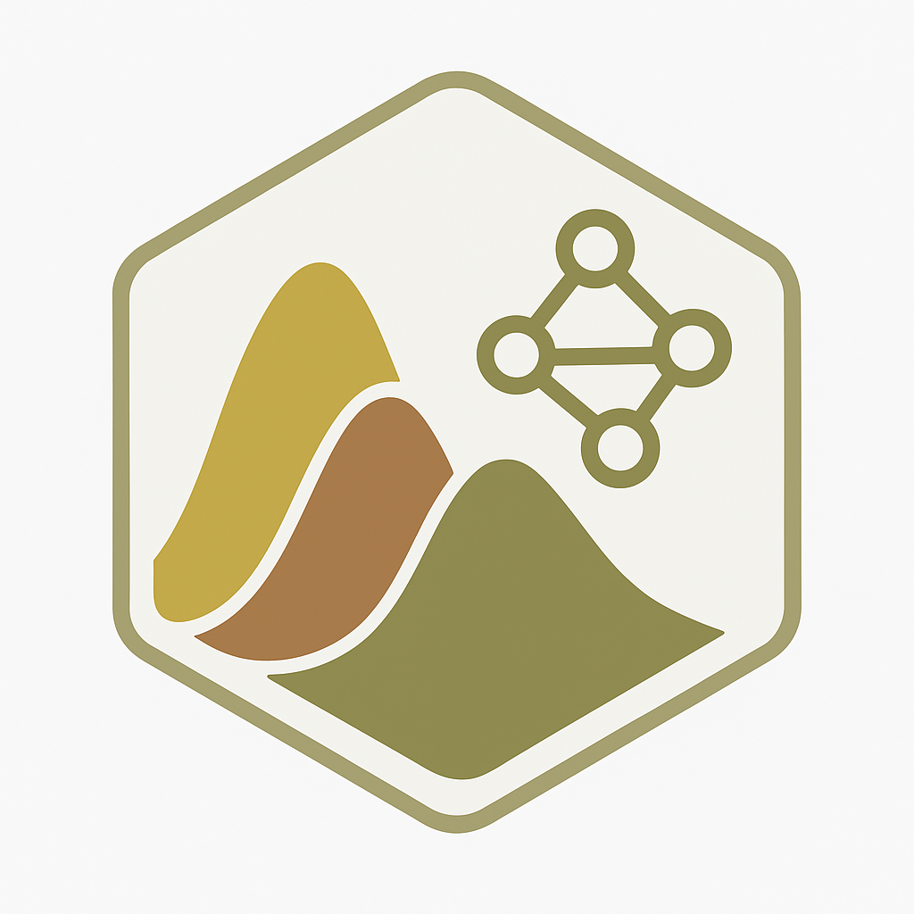

<!-- README.md is generated from README.Rmd. Please edit that file -->

# diversityGPT 

<!-- badges: start -->
[](https://github.com/shandley/diversityGPT/actions/workflows/check-standard.yaml)
<!-- badges: end -->

**diversityGPT** revolutionizes microbiome diversity analysis with the world's first **Universal Diversity Metric Transformation System**. Beyond solving "decision confusion" when metrics conflict, it mathematically relates ANY diversity metrics through information theory, enabling unprecedented meta-analysis and cross-study comparisons.

## 🚀 Revolutionary Features

- 🔄 **Universal Metric Transformation**: Convert between ANY diversity metrics (Shannon → Simpson, Chao1 → Faith's PD, etc.)
- 🧬 **Information Decomposition**: Every metric = R (Richness) + E (Evenness) + P (Phylogenetic) + S (Spatial) components
- 🤝 **Consensus Algorithms**: Resolve conflicts between different metrics with R² > 0.9 accuracy
- 🧠 **AI-Powered Interpretation**: Dual LLM support (Anthropic Claude + OpenAI GPT) for ecological insights
- 📊 **Advanced Visualizations**: Interactive networks, information dashboards, and component analysis
- 🔬 **Cross-Study Standardization**: Enable meta-analysis across different metric sets

## Installation

You can install the development version of diversityGPT from [GitHub](https://github.com/shandley/diversityGPT) with:

``` r
# install.packages("devtools")
devtools::install_github("shandley/diversityGPT")
```

## Quick Start

``` r
library(diversityGPT)
library(phyloseq)

# Load example data
data(GlobalPatterns)

# Extract universal information components
universal_info <- extract_universal_information(GlobalPatterns)
print(universal_info)  # Shows R² = 0.939 deconvolution quality

# Transform between ANY metrics
predicted <- universal_diversity_transform(
  source_metrics = c(shannon = 2.3),
  target_metrics = c("simpson", "chao1", "faith_pd"),
  transformation_matrix = universal_info$transformation_matrix
)

# Visualize metric relationships
plot_diversity_network(universal_info, interactive = TRUE)

# Get AI-powered interpretation
interpretation <- interpret_diversity(
  universal_info,
  context = list(
    environment = "human_gut",
    condition = "treatment_vs_control"
  )
)
```

## The Universal Framework

Traditional diversity analysis treats metrics as isolated measurements. **diversityGPT** reveals they're all mathematically related through information theory:

### The Problem We Solve

1. **Decision Confusion**: When Shannon says significant but Simpson doesn't, what's really happening?
2. **Missing Metrics**: Need Faith's PD but only have Shannon? We can predict it with R² > 0.9
3. **Cross-Study Comparison**: Different studies use different metrics? We standardize them all
4. **Ecological Interpretation**: What do these mathematical patterns mean biologically?

### How It Works

1. **Universal Decomposition**: Every diversity metric = R + E + P + S components
2. **Any-to-Any Transformation**: Convert between ANY metrics using our transformation matrix
3. **Quality Assessment**: Know exactly how reliable each transformation is (R² scores)
4. **AI Integration**: Get real-time ecological interpretation of patterns

## Setting Up API Keys

The package uses AI for intelligent interpretation. Add your API key to `.Renviron`:

```bash
ANTHROPIC_API_KEY=your-key-here
# or
OPENAI_API_KEY=your-key-here
```

Then restart R. The package works with either provider.

## Documentation

- [Getting Started Vignette](vignettes/getting-started.html)
- [Understanding Diversity Metrics](vignettes/diversity-metrics.html)
- [API Configuration Guide](vignettes/api-setup.html)

## Contributing

We welcome contributions! Please see our [Contributing Guide](CONTRIBUTING.md) for details.

## Citation

If you use diversityGPT in your research, please cite:

```
@software{diversityGPT,
  author = {Handley, Scott},
  title = {diversityGPT: AI-Powered Microbiome Diversity Analysis},
  year = {2025},
  url = {https://github.com/shandley/diversityGPT}
}
```

## License

MIT © 2025 diversityGPT authors